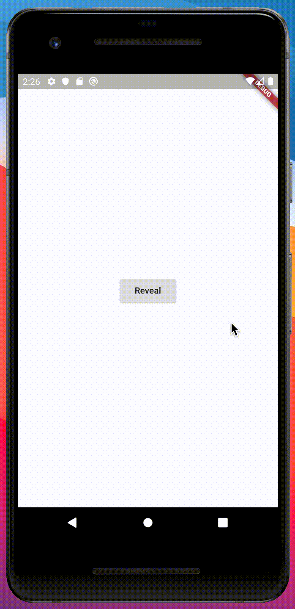
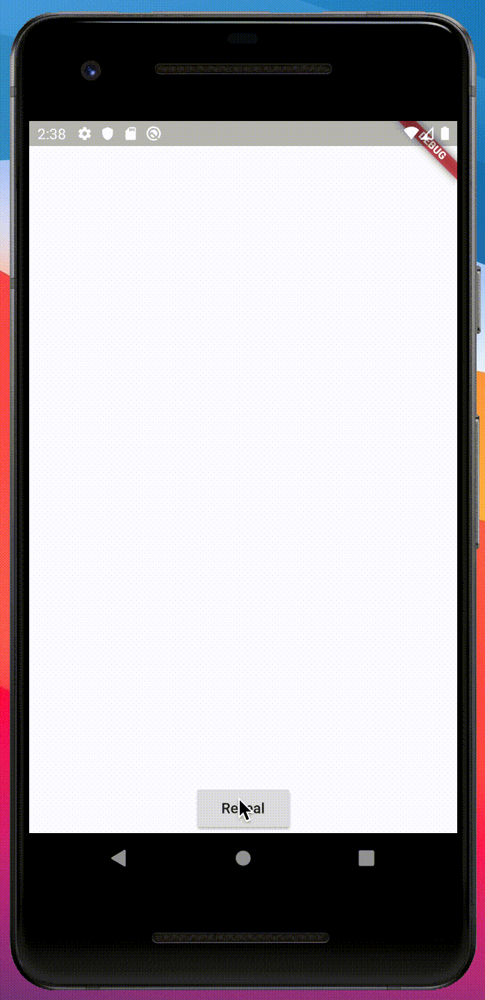

# animated_reveal_stack

A simple animated circular reveal based on stack widget. Works with single widget or list of widgets as children.

  &nbsp; &nbsp; 

  &nbsp; &nbsp; 

## Getting Started
Easy to use, just wrap whatever you need to display inside the AnimatedRevealStack.

```dart
AnimatedRevealStack(
        // This is the starting point of the circular reveal,
        // for now, it's in the middle of our screen.
        offset: Offset(
          MediaQuery.of(context).size.width / 2,
          MediaQuery.of(context).size.height / 2,
        ),
        color: Colors.teal,
        animation: _animation,
        // Nothing fancy here, just a switch to open/close the animation.
        child: Center(
          child: RaisedButton(
            onPressed: () {
              toggle
                  ? _animationController.reverse()
                  : _animationController.forward();
              setState(() => toggle = !toggle);
            },
            child: Text(toggle ? 'Close' : 'Reveal'),
          ),
        ),
      ),
```
## More
See page_2.dart in example folder to see more about AnimatedRevealStack usage.